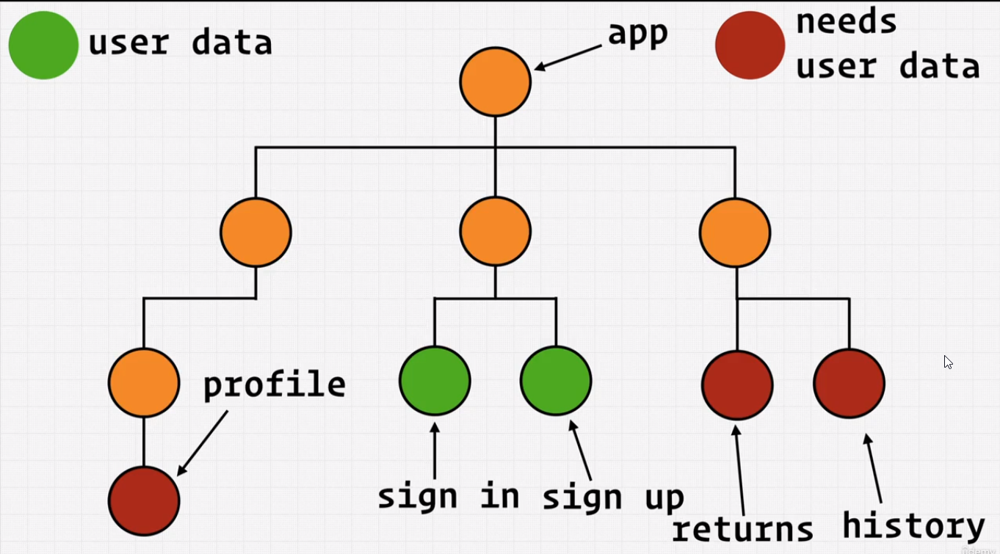

# Contexts

1. Lets say we have multiple childrens from our parent component
2. Now, we want to share some states from one child component to another child component.
3. We will have to first transfer this state to app component which is the topmost parent.
4. Then we will transfer that state to our desired child component.
5. This is very bad, because other parent's don't need that state.
6. In-order for the states that needs to be provided to desired children's only.
7. We will use react context, which will act as a `external storage`
8. Now any component can use this storage.